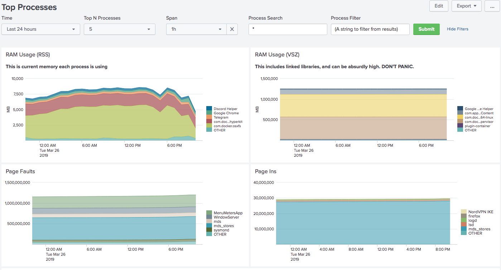
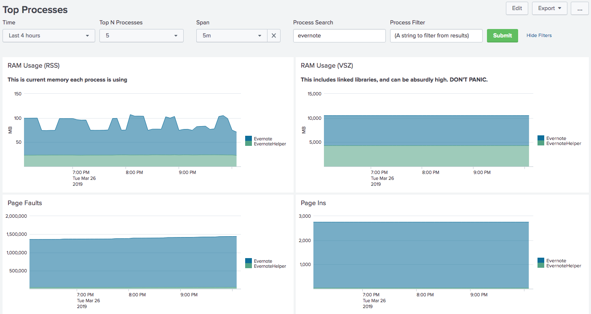
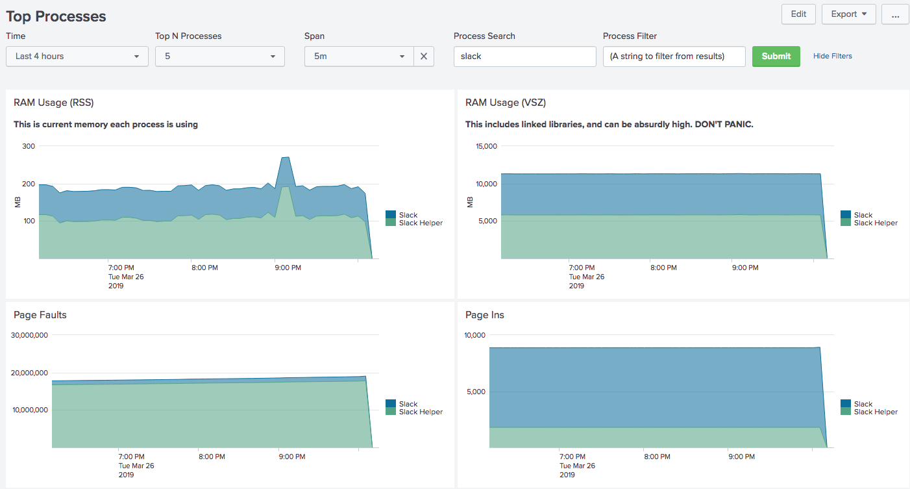

# Mac OS/X RAM Usage

This app lets you graph RAM usage of applications on your Mac.  It was built
and tested on Mac OS/X 10.13.6.

## Screenshots

  

## Requirements

- Python 3
- Docker

## Installaton

- Clone this repo
- Run `pip3 install -r ./requirements.txt` to install the necessary Python modules

## Usage

- Run `sudo ./get-ram-loop.sh` in one shell to start fetching RAM usage in logs.
   - You will be prompted for your password--this is normal so that the script can sudo to root.
   - If you want to run without `sudo`, that is fine, but you will get stats only on your processes.
- Run `start-splunk.sh` to start up Splunk.
   - You will be presented with a list of how Splunk is configured.  If you're happy, press ENTER, if not, press ctrl-C and adjust your environment variables.

Once Splunk is started, it will spin up an instance of 
<a href="https://github.com/dmuth/splunk-lab">Splunk Lab</a> and then run Splunk.
If you already have Splunk Lab, this will take about 10 seconds, if not, it could take
a minute or more for the Docker container to be downloaded.

Once started, the Splunk instance can be accessed at https://localhost:8000/, unless
you chose a different port.

## How It Works

I wrote a version of PS in Python called **Better PS**, and it uses the
<a href="https://pypi.org/project/psutil/">PSUtil module</a> to query the process list
and extract important process attributes and then print them up in a format that Splunk
can parse natively.  This is far FAR saner than trying to parse the output of `ps`.

## Why are you using SSL for talking to localhost?

Why are you not?

## Credits

- <a href="https://www.splunk.com/">Splunk</a>
- <a href="https://pypi.org/project/psutil/">PSUtil</a>

## Contact

Feel free to hit me up on <a href="https://twitter.com/dmuth">,
<a href="https://facebook.com/dmuth">Facebook</a>,
or <a href="https://www.dmuth.org/contact">via email</a> if you 
would like to get in touch.

